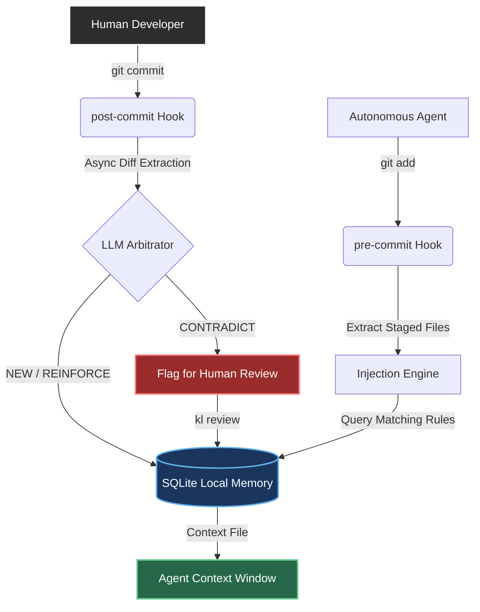

<div align="center">
  

  **A strict, deterministic decision memory harness for terminal coding agents.**

  [](https://opensource.org/licenses/MIT)
  [](https://www.python.org/downloads/)
  [](#)

  *An open-source project, structurally independent from the Klyd SaaS.*
</div>

---

### 🚀 TL;DR (For Non-Technical Reviewers)
**Think of `klyd` as a long-term memory system for AI coding agents.** When an AI is left alone to write code, it often introduces sloppy, disorganized "duct-tape" fixes that destroy a project's architecture over time. `klyd` solves this by automatically learning the strict "architectural rules" of a project every time an engineer saves code, and forcing the AI to strictly obey those rules in the future. 

---

<div align="center">
  <h3>🔥 Klyd in Action</h3>
  <!-- TODO: Replace this placeholder with a 10-15 second GIF showing 'kl review' resolving a conflict -->
  <p><i>[INSERT 10-SECOND GIF HERE: Displaying `kl review` resolving an architectural conflict in the terminal]</i></p>
</div>

---

## 🧠 What is klyd?

`klyd` is a **decision memory harness** for terminal coding agents (like `aider`, `opencode`, and `claude code`). It acts as a structural spine, preventing terminal coding agents from experiencing "architectural drift."

Agentic coding tools fail in a specific, reproducible loop:
1. Agent writes a file.
2. A test or CI pipeline breaks.
3. Agent patches the nearest code block to turn the test green, satisfying the metric but ignoring the root architectural philosophy.
4. After 20 turns, you possess a **slop fortress** — a codebase that compiles, but defies human maintenance.

`klyd` solves this by extracting architectural decisions via LLMs from every git commit, storing them locally in SQLite, and injecting them precisely at the moment of file write.

## 🏗️ System Architecture

`klyd` operates entirely invisibly through Git hooks, intercepting writes without wrapping the agent subprocesses or relying on heavy filesystem watchers.



## ⚙️ Core Engineering Complexities

### In-Database Custom Multi-Glob File Matching
A significant database engineering challenge arises when attempting to map arbitrarily staged Git file paths (e.g., `auth/login.py`) against comma-separated glob rule patterns (`auth/*, security/*`) stored inside an SQLite memory store.

Traditional architectures require either:
1. Inefficient full-table scans pulling all rows into Python application memory.
2. Compiling heavy third-party regex extensions into SQLite.

`klyd` solves this elegantly by **injecting a custom Python callback function (`match_files`) directly into the C-runtime of the SQLite engine**. This allows the SQLite query planner to atomically execute single-pass semantic filtering and vector cosine-similarity ranking dynamically at the database layer. 

### Recursive Decision Lineage
`klyd` maintains an immutable evolutionary tree of architectural changes using **Recursive Common Table Expressions (CTEs)** in SQLite (`WITH RECURSIVE ancestors(...)`), ensuring that legacy architectural rules are gracefully soft-decayed rather than violently overwritten.

---

## ⚡ Quickstart

**Zero Infrastructure.** All state lives in `.klyd/` local to your repo. BYOK (Bring Your Own Key) for Anthropic, OpenAI, OpenRouter, Gemini, or Groq.

```bash
# 1. Initialize in your project repository
cd your-project
kl init

# 2. Configure your API key
kl config --api-key sk-ant-...

# 3. Make commits containing architectural decisions
git commit -m "feat: migrate from raw SQL to SQLAlchemy"

# 4. Check extracted architectural state
kl status

# 5. Run your agent with strict injected memory
kl run aider
```

## 📜 Commands Reference

*   `kl init`: Initializes local `.klyd/` DB and Git hooks.
*   `kl config --show`: Manage multiple BYOK providers.
*   `kl review`: Interactive human-in-the-loop CLI resolution for `CONTRADICT` flags.
*   `kl run <agent>`: Executes standard agents under the memory harness constraint.

## License

MIT License - see [LICENSE](./LICENSE).
